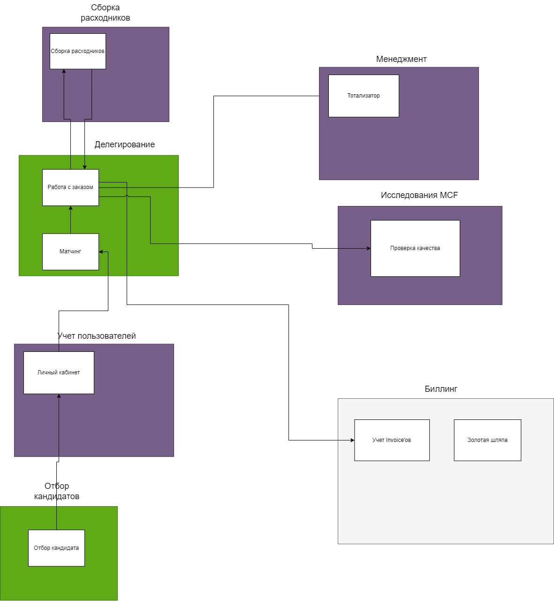

# ES
https://miro.com/app/board/uXjVK5PUXrU=/
Картинка 

# Основная проблема (Domain)
MCF решает проблему утомляемости котов.
Есть коты-тестировщики, у которых есть работа и свои привычные дела.
Они устают от работы + устают от привычных дел.

Цель - сделать так, чтобы коты меньше уставали.
Предполагаемое решение - делегировать привычные дела.
# Subdomains
## Core: Делегирование
**Reasoning:**
Решаемая проблема: снизить утомляемость котов-тестировщиков через делегирование рутины воркерам.
Команда: core-разработчики

Через делегирование задач кота на воркера решаем основную проблему утомляемости котов.
Коты и воркеры непосредственно взаимодействуют с этой частью системы - работают со своими заказами.
Чем лучше процесс делегирования, тем больше клиентов остается в системе.

**Матчинг входит в делегирование как отдельный bounded context**
**Reasoning:**
Решаемая задача: сделать делегирование наиболее эффективным
Команда: исследователи MCF

Лучше воркер подобран под услугу -> лучше качество работы воркера -> меньше утомляемость клиента -> довольнее клиент -> больше денег.
Позиционирование идет через то, что внутри сервиса самые лучшие воркеры (топ 3%), поэтому это Core.

Матчинг - это отдельный bounded context в рамках поддомена "Делегирование", т.к. в нем используется другой язык ([US-290]), им занимается другая команда (скорее всего, исследователи MCF)
## Core: Отбор кандидатов
**Reasoning:**
Решаемая проблема: добавлять в систему только 3% воркеров, чтобы матчинг стал самым лучшим среди конкурентов.
Команда: менеджеры (или часть менеджмента)

Лучше воркеры в системы -> лучше матчинг -> лучше качество работы в среднем -> меньше утомляемость клиента -> довольнее клиент -> больше денег - основная проблема решена.

TOP 3% воркеров означает высокий конкурс в начале и большую стоимость за работу.
Если удастся создать такие условия, это будет конкурентным преимуществом.
К тому же в требования была фраза
> Для бизнеса критично проверять новые гипотезы по отсеву котов.

Следовательно, для бизнеса это критичный поддомен.

Поддомен отделен от поддомена "Матчинг", потому что матчинг работает только с существующими воркерами в системе. Есть явный temporal coupling.
## Supporting: Сборка расходников
**Reasoning:**
Решаемая проблема: 
- Ускорение выполнения заказов (подготавливаем все для воркера, чтобы он быстрее работал)
- Повышение лояльности клиентов (печенье давать)
Команда: отдел расходников

Расходники не решают основную проблему - уменьшить утомляемость котов. 
Но без расходников нельзя - нужно оформлять документы и предоставлять хороший сервис (давать печенье).
## Supporting: Учет пользователей
Решаемая проблема:
- Нужно понимать, какие воркеры и клиенты находятся в системе.

Bounded Context - личный кабинет воркера и клиента.

## Supporting: Исследования по MCF (R&D)
**Reasoning:**
Решаемая проблема: 
- нужно как-то генерировать новые гипотезы для улучшения бизнеса в целом.
Команда: исследователи MCF

Исследования не сами по себе нужны, а для улучшения Core-поддоменов - матчинга и делегирования. 
Делегировать нельзя, так как есть тесная связь с данными, которые генерируются в Core-системе.

Предполагаемое решение (bounded context) - проверять качество заказов.
## Supporting: Менеджмент
**Reasoning:**
Решаемые проблемы: 
- Проблема лояльности менеджмента (нужно повышать, чтоб все работало)
Команда: менеджеры

Менеджмент в текущем виде - это support-команда.
Они проверяют качество работы, подкручивают систему (добавляют типы услуг), ставят ставки, работают с воркерами (рандом дают им деньги). 
В общем, поддерживают основную систему, а не предоставляют конкурентное преимущество.
## Generic: Биллинг
Решаемые проблемы:
- Повышение лояльности клиентов (скидки, внезапная оплата от менеджера)
- Нужно оплачивать заказы
Команда: ?

Generic, потому что скорее всего можно какое-нибудь готовые решение взять. К тому же была упомянута золотая шляпа.
Подсчет скидок и мелкие тех.решения могут превратить этот subdomain в supporting, но с низкой бизнес-дифференциацией.

# Сравнение
## Вынесен новый Bounded Context "Матчинг"
**Reasoning:**
- Другой язык применяется ([US-290])
- Скорее всего другая команда занимается им (Исследователи MCF)
- Будет дальше активно развиваться (это инновационный алгоритм - будет много экспериментов с ним)

# Характеристики
- Общая нагрузка на систему не будет превышать 10 заказов в день и 100 клиентов. Воркеров будет около 20 котов - говорит о scalability по заказам/личному кабинету.
## Важные характеристики
**Core:Делегирование:** scalability, availability, agility, testability, deployability, modifiability, evolvability
- Кол-во матчей = кол-во заказов - scalability
- Без назначения воркера на заказ клиент не может получить оперативно услугу - availability
  *Но нужно ли получать её оперативно?*
- Исследователи MCF пока не знаю, что вообще будет в матчинге, поэтому много экспериментируют ([US-060] + общие пожелания) - agility, modifiability, evolvability
- Нужен низкий ТТМ - agility, testability, deployability

**Core:Отбор кандидатов**: modifiability, elasticity, scalability
- В общих пожеланиях было написано про "набор гипотез по отсеву котов" - modifiability
- Возможно, будет наплыв котов и DDOS (пиковая нагрузка) ([US-081]) - elasticity, scalability.

**Supp:Менеджмент**: securability, simplicity,
- Менеджеры имеют доступ к внутренней информации компании (предположение)- securability
- Это не Core-поддомен и все сервисы здесь можно делать простыми, чтобы не тратить ресурсы ([US-261])- simplicity

**Supp:Исследования по MCF**: simplicity
- Почти ничего про проверку качества не написано в требованиях. Нужна только форма для отправки результатов проверки ([US-180])

**Supp:Сборка расходников**: scalability, simplicity, testability
- Кол-во заказов ~ кол-во расходников ~ кол-во клиентов ([US-150]) - scalability
- Сотрудники собирают заказы так, как им комфортно ([US-140]) - simplicity

**Биллинг:** testability, debuggability, securability
- Ошибка с денежными операциями дорого стоит, поэтому нужно все хорошо тестировать - testability
- Если все же произошла ошибка, нужно иметь возможность легко найти причину - debuggability
- Нужно соответствовать PCI DSS и не допустить утечки данных - securability
# Архитектурный стиль
## Модульный монолит для менеджеров и исследователей
**Reasoning:**
- Нагрузка на оба сервиса небольшая (проверки качества не в real time и не на каждый заказ)
- Форма с проверкой качества небольшая + проверкой качеств сейчас менеджеры занимаются - simplicity.

## Микросервис для сборки расходников
**Reasoning**:
- 1 расходник - 1 заказ - 1 клиент. Следовательно, если core-заказы масштабируются, то и сборка расходников должна масштабироваться. (scalability)

## Микросервисы для всех контекстов Core поддоменов
**Reasoning:**
- Неограниченный бюджет - cost
- "Команды будут определены после архитектурного решения." - можно сразу распределить их по bounded context'ам.
- Нужно тестировать много гипотез (отсев, матчинг) - modifiability, evolvability

# Спорные моменты
- Возможно, подсчет стоимости тоже будет отдельным поддоменом. Есть временная связь с матчингом + есть подозрение, что исследователи MCF тоже разрабатывают особый алгоритм для подсчета стоимости ([US-050])
- Скорее всего платежку нужно разделить на скидки, штрафы, начисления
- Предполагаю, что стоит ещё добавить subdomain "Лояльность пользователей" со скидками и рандомными выплатами менеджмеров ([US-240])

